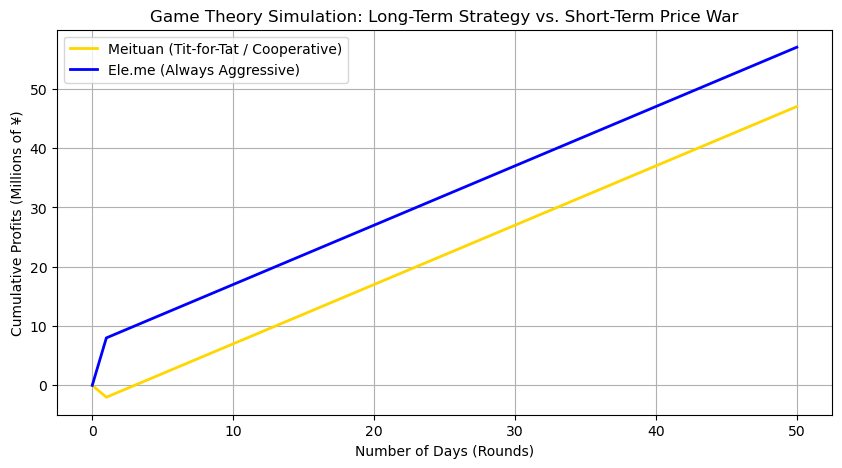
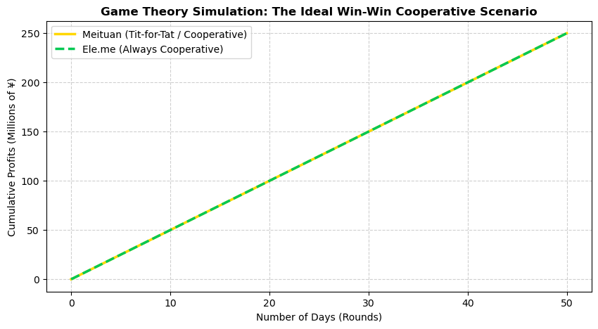
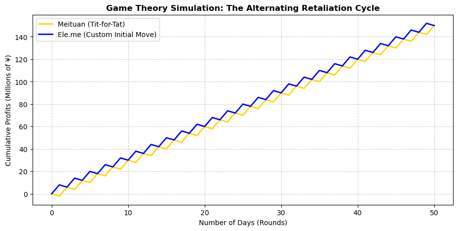

# Game Theory: Price War in a Duopoly Market

> When two rivals compete every day, is a price war worth it?

This project models a duopoly between two food-delivery platforms, **Meituan** and **Ele.me**, as an **iterated Prisoner's Dilemma** and uses simulation to compare how three strategy pairings play out over 50 rounds (1 round = 1 day).

## The game

Each day both firms choose simultaneously between **Cooperate** (read: hold prices / limit subsidies) and **Defect** (read: cut prices aggressively). Payoffs are in millions of ¥ per day, written as *(Meituan, Ele.me)*:

| | Ele.me: Cooperate | Ele.me: Defect |
| --- | --- | --- |
| **Meituan: Cooperate** | (5, 5) | (−2, 8) |
| **Meituan: Defect** | (8, −2) | (1, 1) |

The payoffs satisfy the Prisoner's Dilemma conditions (temptation 8 > reward 5 > punishment 1 > sucker's payoff −2, and 2 × 5 > 8 + (−2)): defecting is tempting in any single round, yet mutual cooperation beats mutual defection.

**Strategies used**
- **Tit-for-Tat (TfT):** cooperate on round 1, then copy the opponent's previous move.
- **Always Defect** and **Always Cooperate.**
- **Defect-first TfT:** defect on round 1, then play Tit-for-Tat.

## Scenarios and results

| # | Meituan | Ele.me | Meituan profit | Ele.me profit | Total value |
| --- | --- | --- | --- | --- | --- |
| 1 | Tit-for-Tat | Always Defect | 47 M¥ | 57 M¥ | 104 M¥ |
| 2 | Tit-for-Tat | Always Cooperate | 250 M¥ | 250 M¥ | **500 M¥** |
| 3 | Tit-for-Tat | Defect-first Tit-for-Tat | 150 M¥ | 150 M¥ | 300 M¥ |

### 1. Always Defect vs. Tit-for-Tat

Ele.me exploits Meituan once (+8 vs. −2 on day 1). From day 2 on, Meituan retaliates and both firms are stuck in mutual defection at +1 per day. Ele.me finishes ahead, but both earn far less than the 250 M¥ each that cooperation would have delivered.

### 2. Always Cooperate vs. Tit-for-Tat

Tit-for-Tat never has a reason to retaliate, so both firms cooperate every day: an equal split and the largest total value.

### 3. Defect-first Tit-for-Tat vs. Tit-for-Tat

The opening defection sets off an "echo": each firm keeps punishing the other's previous move, so they alternate between exploiting and being exploited. Profits are equal at the end but well below mutual cooperation, and the path is highly volatile.

## Key takeaways

- **Cooperation maximises joint value** (500 M¥) and gives each firm its best sustainable payoff.
- **Aggression against a retaliating rival pays off only in the very short run.** Against Tit-for-Tat, always defecting earns 8 + (n − 1) over n rounds versus 5n for cooperating: better only for a single round (8 vs. 5), worse from two rounds on (9 vs. 10).
- **A single early defection can lock a market into a costly cycle**: mutual defection (scenario 1) or alternating retaliation (scenario 3).

## Repository structure

The simulations are deterministic (no randomness, no external data), so results are identical on every run and the notebook executes in a few seconds.

## Requirements

matplotlib>=3.7
notebook>=7.0
ipykernel>=6.25

## Limitations

- **Illustrative payoffs.** The payoff matrix is a stylised assumption, not estimated from Meituan's or Ele.me's actual financials, so the numbers show mechanisms rather than real-world profits.
- **Stylised world.** Two players, simultaneous moves, a fixed 50-round horizon, no discounting, no noise or misperception, and no entry, product differentiation or regulation.
- **Limited comparison.** Only three pairings are simulated; there is no full round-robin between all strategies.
- **Finite horizon.** With a known, finite number of rounds, standard backward-induction arguments predict defection; the simulations do not test this.

## Possible extensions

- Round-robin tournament across more strategies (Grim Trigger, Pavlov, Generous Tit-for-Tat, random), Axelrod-style.
- Add noise (occasional mistaken moves) and a discount factor.
- Sensitivity analysis on the payoff values and the horizon length.
- Move from a binary choice to continuous prices (Bertrand competition).