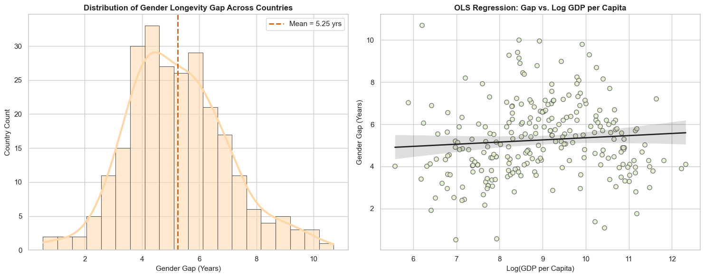
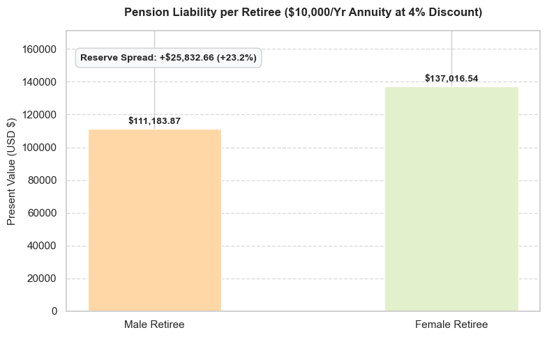

# Global Longevity Gap & Pension Liability Modeling

> Does national wealth change how much longer women live than men — and what does that gap cost a pension fund?

This project combines a **cross-country regression** (World Bank data, 2021) with a **simple actuarial valuation** to quantify the financial impact of the gender longevity gap on lifetime annuities.

## Key findings

| Question | Result |
| --- | --- |
| Average gender longevity gap (female − male life expectancy at birth) | **5.25 years** (median 5.08) |
| Effect of GDP per capita on the gap (OLS on log GDP) | **Not significant**: β₁ = 0.102, *p* = 0.188, R² = 0.007 |
| Extra capital needed per female retiree vs. male (\$10,000/yr annuity from 65, 4% discount rate) | **+\$25,832.66 (+23.2%)** |

**Hypothesis 1 — rejected.** Higher GDP per capita does not significantly widen the gap; wealth explains less than 1% of its variance.
**Hypothesis 2 — supported under the model's assumptions.** The female annuity premium (+23.2%) exceeds the 20% threshold.

## Results

## Data

World Bank, *World Development Indicators* — licensed under [CC BY 4.0](https://datacatalog.worldbank.org/public-licenses#cc-by).
Pulled live from the [World Bank Indicators API](https://datahelpdesk.worldbank.org/knowledgebase/articles/889392-about-the-indicators-api-documentation) for the year **2021** (no API key needed).

| Variable | World Bank indicator |
| --- | --- |
| Female life expectancy at birth | `SP.DYN.LE00.FE.IN` |
| Male life expectancy at birth | `SP.DYN.LE00.MA.IN` |
| GDP per capita (current US$) | `NY.GDP.PCAP.CD` |

Derived variables: `gender_gap = female_le − male_le` and `log_gdp = ln(gdp_pc)`. Rows with missing values are dropped (n = 253).

## Methodology

**1. Regression** — OLS with non-robust standard errors:

`gender_gap = β₀ + β₁ · ln(GDP per capita) + ε`

Two-tailed *t*-tests (α = 0.05), overall *F*-test, Jarque-Bera / Omnibus tests on residuals, 95% confidence interval on β₁.

**2. Actuarial valuation** — present value of an ordinary annuity:

`PV = PMT × [1 − (1 + r)^(−N)] / r`

with PMT = \$10,000/year from age 65, r = 4%, Nmale = 15 years (assumed baseline) and Nfemale = 15 + 5.25 = 20.25 years.

| | Male | Female | Spread |
| --- | --- | --- | --- |
| Present value | \$111,183.87 | \$137,016.54 | **+\$25,832.66 (+23.2%)** |

## Getting started

pandas>=2.0
numpy>=1.24
requests>=2.31
statsmodels>=0.14
matplotlib>=3.7
seaborn>=0.12
notebook>=7.0
ipykernel>=6.25

An internet connection is required for the first cell, which downloads the data.

**Reproducibility notes**
- The World Bank occasionally revises published series, so re-running the notebook may shift figures slightly.
- The valuation cell hard-codes the mean gap (`5.25`) rather than reading it from the DataFrame; update it if your fetched data differ.

## Limitations

- **Sample composition.** The API call keeps every row with a non-empty ISO3 code, which also retains World Bank regional and income-group aggregates (e.g. World, Euro area). The World Bank lists only about 200+ economies, so the 253 observations very likely include some aggregates. Filtering them out is a natural robustness check.
- **Birth vs. age-65 gap.** The valuation adds the gap in life expectancy *at birth* to the remaining life expectancy *at 65*. The gap at 65 is usually smaller, so the 23.2% premium is likely an overestimate.
- **Simplified annuity.** A certain annuity over a fixed horizon with a flat 4% rate — no survival probabilities, mortality improvements or interest-rate risk.
- **Single year.** 2021 was affected by COVID-19 mortality, which may distort the gap in some countries.
- **Cross-sectional, non-robust inference.** Jarque-Bera rejects residual normality (*p* = 0.015); heteroskedasticity-robust errors would be a sensible check.

## Possible extensions

- Use age-65 life expectancy (e.g. WHO / UN life tables) and survival-weighted annuity pricing.
- Sensitivity analysis on the discount rate and the male baseline horizon.
- Multi-year panel with fixed effects; add controls (health expenditure, education, urbanisation).

